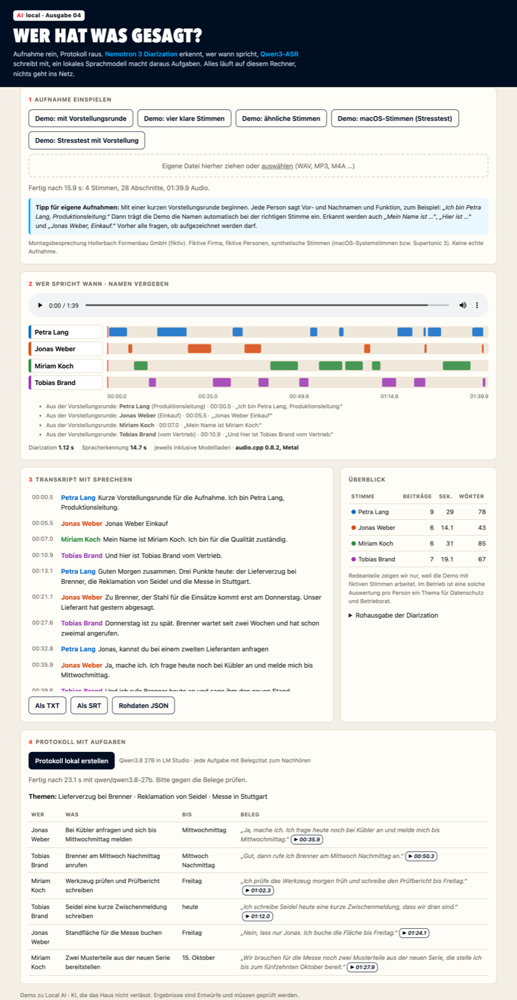

# Wer hat was gesagt?

Eine Besprechungsaufnahme lokal in ein Protokoll mit Aufgaben, Verantwortlichen und Terminen verwandeln. Die Demo gehört zu **Local AI, Ausgabe 04**, dem deutschen LinkedIn-Newsletter von Christian Hubmann.

Drei Bausteine, alle auf dem eigenen Rechner:

1. **Nemotron 3 Diarization** (NVIDIA, 23.09.2026) erkennt, wer wann spricht. Das Modell gibt keine Namen und keinen Text aus, sondern nur Sprecher 1, 2, 3 mit Zeitstempeln.
2. **Qwen3-ASR 0.6B** schreibt jeden erkannten Abschnitt auf Deutsch mit.
3. **Namen aus der Vorstellungsrunde:** Sagt jede Person zu Beginn „Ich bin Petra Lang, Produktionsleitung“, liest die Demo Vor- und Nachnamen aus dem Transkript und trägt sie bei der richtigen Stimme ein. Kein Stimmprofil, keine Biometrie.
4. **Qwen3.8 27B** in LM Studio macht aus dem Transkript ein Protokoll. Jede Aufgabe trägt ein wörtliches Belegzitat mit Zeitstempel.

Die ersten beiden laufen über [audio.cpp](https://github.com/0xShug0/audio.cpp) 0.8.2 mit Metal, das Nemotron 3 Diarization seit dem 24.09.2026 in einem Release unterstützt.



## Schnellstart

Voraussetzungen: Mac mit Apple Silicon, Python 3.11 oder neuer, `ffmpeg`. Für das Protokoll zusätzlich [LM Studio](https://lmstudio.ai) mit einem geladenen Modell.

```sh
python3 scripts/install.py          # audio.cpp und zwei Modelle, rund 1,4 GB, jede Datei per SHA256 geprüft
python3 scripts/server.py           # http://127.0.0.1:8790
```

Für das Protokoll (optional):

```sh
lms server start
lms load qwen/qwen3.8-27b
```

Auf der Seite eine Demo-Besprechung wählen oder eine eigene Datei hineinziehen. Namen werden aus der Vorstellungsrunde übernommen oder von Hand eingetragen, dann „Protokoll lokal erstellen“.

## Tipp: Vorstellungsrunde

Damit die Namen automatisch bei der richtigen Stimme landen, stellt sich zu Beginn jede Person einzeln mit Vor- und Nachnamen vor, gern mit Funktion. Erkannt werden unter anderem:

- „Ich bin Petra Lang, Produktionsleitung.“
- „Mein Name ist Miriam Koch.“
- „Hier ist Tobias Brandt vom Vertrieb.“
- „Jonas Weber, Einkauf.“

Ausgewertet wird nur die erste Minute. Nennt eine Stimmspur zwei verschiedene Namen, zeigt die Seite eine Warnung: Dann hat das Modell vermutlich zwei Personen zusammengelegt. Gleich klingende Nachnamen („Brand“ statt „Brandt“) gegenlesen oder buchstabieren. Im selben Moment lässt sich gut fragen, ob alle mit der Aufnahme einverstanden sind. Der Server lauscht nur auf 127.0.0.1; Aufnahmen, Transkripte und Protokolle bleiben im Ordner `jobs/`.

Ohne Oberfläche:

```sh
python3 scripts/pipeline.py fixtures/besprechung-supertonic.wav --out results/mein-lauf \
  --names '{"speaker_0": "Petra", "speaker_1": "Jonas", "speaker_2": "Tobias", "speaker_3": "Miriam"}' --protocol
```

## Was getestet wurde

Eine fiktive Montagsbesprechung der ebenso fiktiven Hollerbach Formenbau GmbH: vier Personen, 24 Beiträge, sieben Aufgaben. Eine Zusage wird zurückgenommen, eine an jemand anderen übergeben, eine Bestellung ausdrücklich verschoben. An vier Stellen reden zwei Personen gleichzeitig.

Alle Stimmen sind synthetisch. So steht vorab exakt fest, wer wann spricht. Soll-Zeitleiste und erwartete Aufgaben wurden vor dem ersten Modelllauf in einem eigenen Commit festgeschrieben (`2785256`). Die Besprechung gibt es in drei Stimmsätzen:

| Stimmsatz | Stimmen | Dauer |
|---|---|---|
| `supertonic` | Supertonic 3, neuronale Stimmen F1, M2, F3, M4 | 87 s |
| `supertonic-aehnlich` | Supertonic 3, benachbarte Stimmen F1, M1, F2, M2 | 83 s |
| `macos` | macOS-Systemstimmen Anna, Reed, Shelley, Eddy | 104 s |

Mit `--vorstellung` stellen sich zu Beginn alle vier vor (vier verschiedene Formulierungen): `supertonic-vorstellung` (100 s) und `macos-vorstellung` (120 s).

## Ergebnisse

MacBook Pro M4 Max, 128 GB, audio.cpp 0.8.2 mit Metal, 24.09.2026. Diarization Error Rate (DER) ohne Toleranzzone an den Grenzen, gerechnet in 10-ms-Schritten gegen die Soll-Zeitleiste (`eval/der.py`).

| Stimmsatz | DER | davon Verwechslung | Personen erkannt | Beiträge richtig zugeordnet | DER nur in Überlappungen |
|---|---|---|---|---|---|
| `supertonic` | 2,13 % | 0,00 % | 4 von 4 | 24 von 24 | 4,81 % |
| `supertonic-aehnlich` | 2,27 % | 0,00 % | 4 von 4 | 24 von 24 | 4,22 % |
| `macos` | **20,69 %** | 15,18 % | **3 von 4** | **19 von 24** | 29,00 % |

**Vorstellungsrunde:** Mit `supertonic-vorstellung` wurden alle vier Namen der richtigen Stimme zugeordnet (28 von 28 Beiträgen richtig, DER 1,95 %); die Spracherkennung schrieb „Tobias Brand“ statt „Brandt“. Bei `macos-vorstellung` legte das Modell drei Personen in eine Spur (DER 26,33 %); die Warnung „eine Stimmspur nennt 3 Namen“ schlug an. In Besprechungen ohne Vorstellungsrunde wurde kein Name erfunden.

**Geschwindigkeit:** Die Diarization läuft mit dem 230- bis 300-Fachen der Echtzeit, einschließlich Modellladen etwa eine Sekunde für 87 Sekunden Audio. Die Spracherkennung braucht 12 bis 13 Sekunden einschließlich Laden. Das Protokoll kostet mit Qwen3.8 27B rund 21 bis 23 Sekunden.

**Was nicht funktioniert hat:**

- Bei den macOS-Stimmen legt das Modell Jonas (Reed) und Tobias (Eddy) ohne jede Warnung zu einer Person zusammen. Alle fünf Beiträge von Jonas landen bei Tobias. Beide Stimmen stammen aus derselben alten Sprachsynthese und klingen sehr ähnlich. Mit den neuronalen Stimmen tritt das nicht auf, auch nicht mit den benachbarten. Ob es bei echten, ähnlich klingenden Kollegen passiert, zeigt dieser Test nicht.
- Außer Anna erkennt Qwen3-ASR die macOS-Stimmen kaum („Zubrina, der Staufer Diänes“ statt „Zu Brenner, der Stahl für die Einsätze“). Für diesen Stimmsatz gibt es deshalb kein Protokoll.
- Im Protokoll zum Stimmsatz `supertonic` sind 6 von 7 Aufgaben der richtigen Person zugeordnet (`eval/check_protocol.py`). Die Messefläche schreibt das Sprachmodell Jonas zu, in zwei getrennten Läufen an derselben Stelle, obwohl Petra sagt: „Nein, lass nur, Jonas. Ich buche die Fläche bis Freitag.“ Die Sprechererkennung war an dieser Stelle richtig; das Sprachmodell hat die Anrede für den Sprecher gehalten. Beim Werkzeug steht „Freitag“ statt „morgen früh“, weil zwei Aufgaben in einer Zeile gelandet sind.
- Wo zwei Personen gleichzeitig reden, hört die Spracherkennung beide Stimmen im selben Ausschnitt. Einzelne Wörter gehen dort verloren.

Rohausgaben: `results/diar-*/turns.json`, Auswertungen: `results/diar-*/der.json`, Transkripte und Protokoll: `results/lauf-*/`.

## Grenzen

- Synthetische Stimmen, fiktive Inhalte, keine echte Aufnahme und kein Raumklang. Ein realer Besprechungsraum mit Tischmikrofon ist schwieriger.
- Deutsch steht nicht in der Liste der Trainingssprachen von Nemotron 3 Diarization. Die Ergebnisse oben sind ein erster Hinweis, keine Freigabe.
- NVIDIA testet das Modell offiziell nur unter Linux mit NVIDIA-GPUs. Der Weg über audio.cpp und Metal ist ein Community-Weg.
- Das Protokoll ist ein Entwurf. Die Belegzitate sind dazu da, jede Aufgabe in Sekunden nachzuhören.

## Vor dem Einsatz mit echten Aufnahmen

Das hier ist keine Rechtsberatung, aber drei Punkte gehören vor jeden echten Test:

- **Einwilligung:** Nichtöffentlich gesprochenes Wort ohne Befugnis aufzunehmen ist nach § 201 StGB strafbar. Alle Beteiligten müssen vorher zustimmen.
- **Betriebsrat:** Eine Auswertung wie Redezeit pro Person ist objektiv geeignet, Verhalten oder Leistung zu überwachen. Nach § 87 Abs. 1 Nr. 6 BetrVG reicht diese Eignung für die Mitbestimmung. Die Oberfläche zeigt Redeanteile nur, weil die Demo mit fiktiven Stimmen arbeitet.
- **Stimme als Merkmal:** Wer Personen anhand ihrer Stimme wiedererkennt, verarbeitet biometrische Daten. Diese Demo tut das nicht: Namen vergibt ein Mensch von Hand.

## Aufbau

```
fixtures/   Besprechung (Drehbuch, erwartete Aufgaben), drei Stimmsätze mit Soll-Zeitleiste
scripts/    install.py, make_meeting.py (Testbesprechung erzeugen), pipeline.py, server.py
eval/       der.py (Diarization-Fehlerrate), check_protocol.py (Aufgaben gegen Erwartung)
web/        die Oberfläche, eine einzelne HTML-Datei ohne externe Abhängigkeiten
results/    Rohausgaben und Auswertungen der Läufe vom 24.09.2026
docs/       Download-Manifest mit Prüfsummen, CLI-Hilfe von audio.cpp
```

Testbesprechung neu erzeugen: `python3 scripts/install.py --mit-tts`, dann `uv run --with numpy python scripts/make_meeting.py --engine supertonic`.

## Lizenzen

Code in diesem Repository: MIT. Modelle und audio.cpp werden nicht mitgeliefert, sondern von ihren Quellen geladen und stehen unter eigenen Lizenzen: Nemotron 3 Diarization unter OpenMDW-1.1, Qwen3-ASR und audio.cpp unter Apache 2.0.

## For English readers

A local pipeline that turns a meeting recording into minutes with owners and deadlines: NVIDIA Nemotron 3 Diarization and Qwen3-ASR via audio.cpp on Apple Silicon (Metal), minutes by a local LLM in LM Studio. Tested on a synthetic German four-person meeting with known ground truth: 2.1 % DER with distinct neural voices, but two similar legacy macOS voices were silently merged into one speaker (20.7 % DER). The LLM assigned 6 of 7 tasks correctly and mistook an addressee for the speaker once. A short introduction round at the start (“Ich bin Petra Lang …”) fills in names automatically and flags merged voices.
